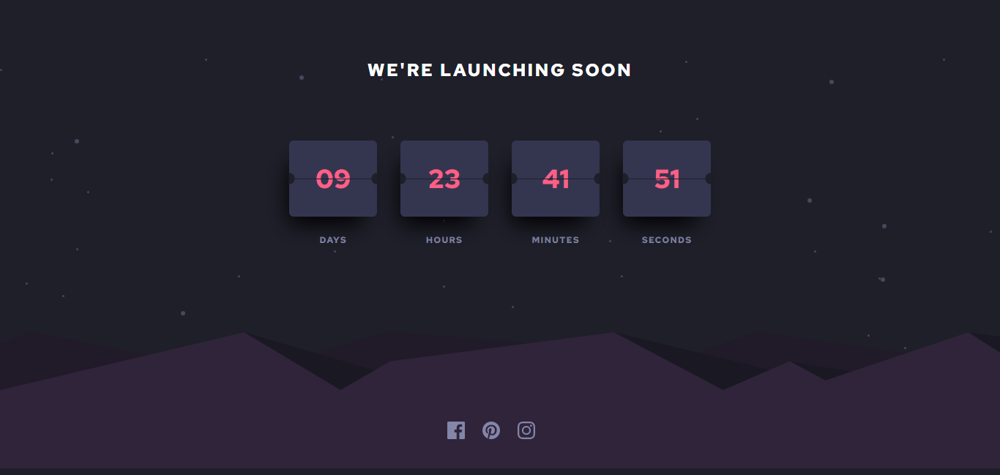

# Frontend Mentor - Launch countdown timer solution

This is a solution to the [Launch countdown timer challenge on Frontend Mentor](https://www.frontendmentor.io/challenges/launch-countdown-timer-N0XkGfyz-). Frontend Mentor challenges help you improve your coding skills by building realistic projects.

### The challenge

Users should be able to:

- See hover states for all interactive elements on the page
- See a live countdown timer that ticks down every second (start the count at 14 days)
- **Bonus**: When a number changes, make the card flip from the middle

### Screenshot



### Links

- Solution URL: [Github repo](https://github.com/JustShuaib/launch-countdown)
- Live Site URL: [Live site](https://launch-countdown-shuaib.netlify.app/)

## My process

### Built with

- [Tailwind CSS](https://www.tailwindcss.com)
- JavaScript

### What I learned

I especially liked the part where I used CSS to make the semi-circle 😀.
The `calc` function also came in handy 🤩

```css
div::before {
  top: calc(50% - 4px);
  transform: rotateZ(90deg);
  border-radius: 15px 15px 0px 0;
}
```

### Continued development

I'd like to work more on how to add animation to the cards as the seconds counts, I saw some solutions, but I don't quite understand them yet.
I think there is also a library for implementing the animation. I'm definitely checkng out!

### Useful resources

- [Adding 10 days to the date whenever the page loads](https://codewithhugo.com/add-date-days-js/) - This helped me when I wanted to auto update the number of days left for the deadline.

## Author

- Github - [Adeoti Shuaib](https://www.github.com/JustShuaib)
- Frontend Mentor - [@justshuaib](https://www.frontendmentor.io/profile/justshuaib)
- Twitter - [@JustShuaib](https://www.twitter.com/JustShuaib)
